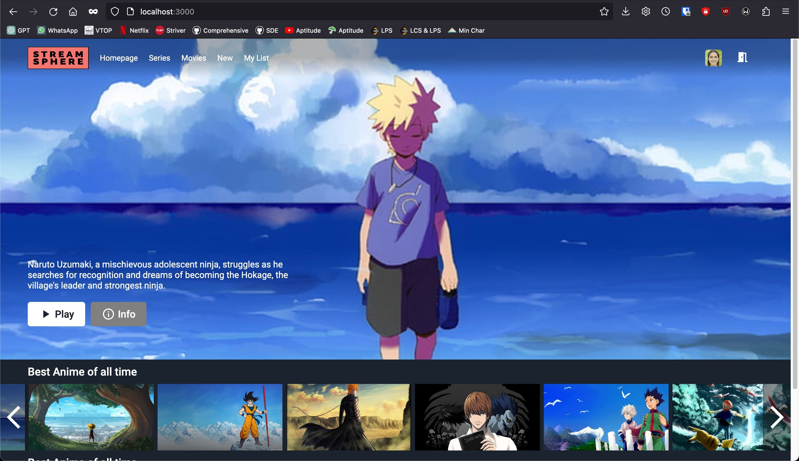
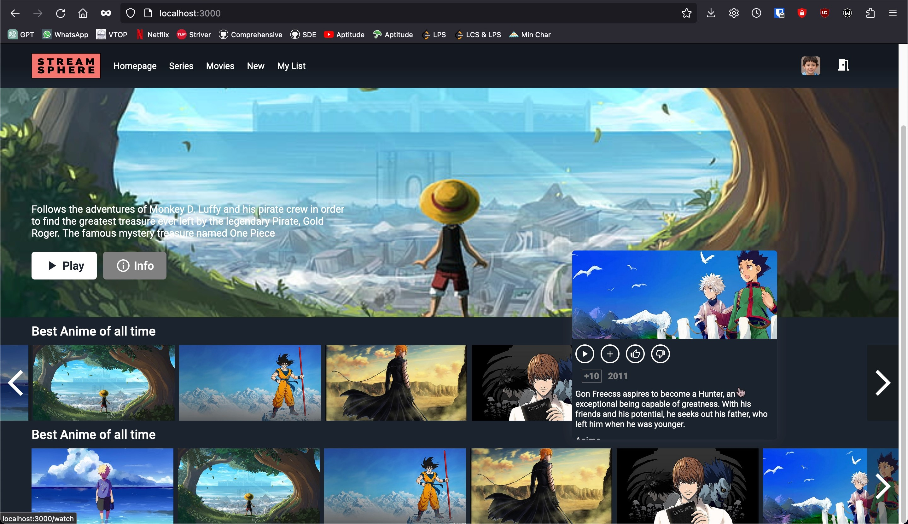
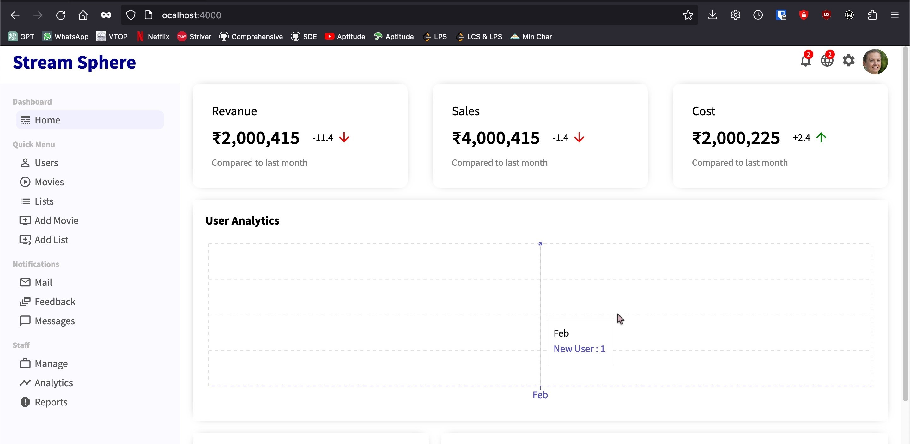
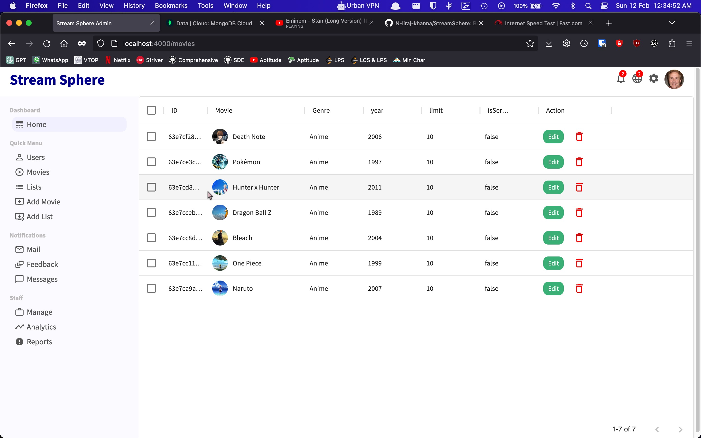
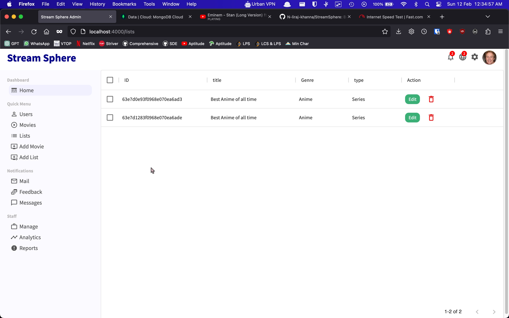
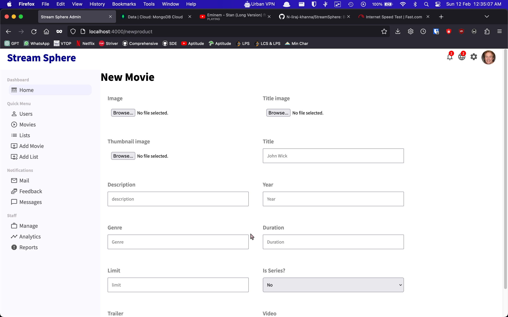
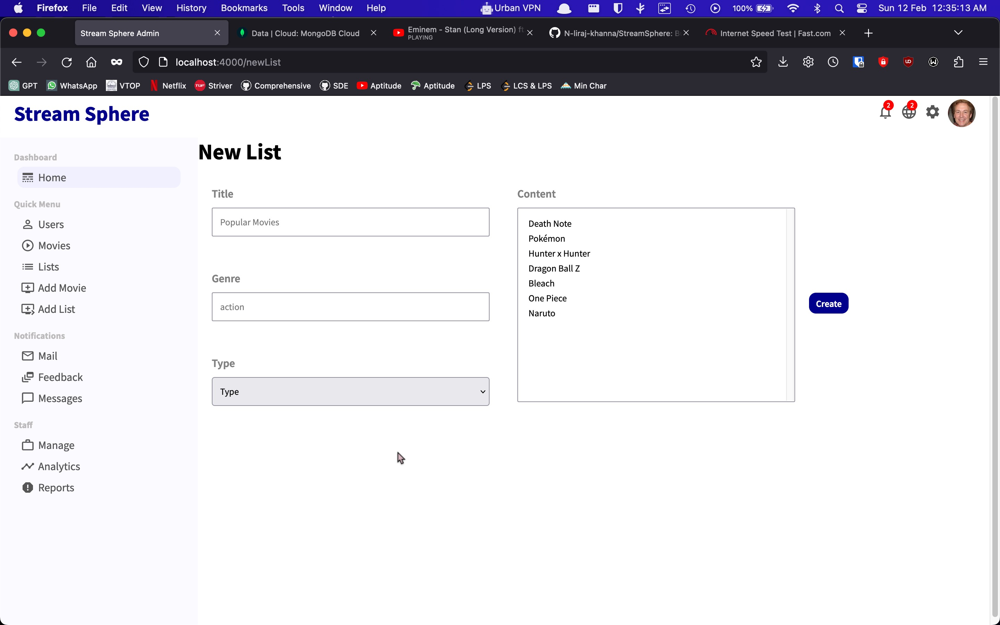

<h1 align="center">
  <br>
  
  <br>
  Welcome to Stream Sphere 👋
  <br>
</h1>
<h4 align="center">A Video streaming web application with dashboard for admin and complete control over users and the videos to be uploaded, the users can register, sign in and stream movies & series.</h4>

<p align="center">
  <a href="#introduction">Introduction</a> •
  <a href="#application-in-action">Application in Action</a> •
  <a href="#installation">Installation</a> •
  <a href="#application-structure">Application Structure</a> •
  <a href="#key-features">Key Features</a> •
  <a href="#how-to-use">How To Use</a> •
  <a href="#credits">Credits</a> •
</p>

## Introduction

Welcome to Stream Sphere, this is an Video Streaming application, similar to Netflix, Amazon Prime, Hulu, Apple TV+ and more more. The admin will have the whole control of everything that happens in the environment. The Admin Panel provide features to view users, when they joined with graphical view in a graph(Analytics), delete, and latest joined members. The admin can only upload movies and series for the users to stream, and select the list its supposed to show. Later can edit any movie and the list itself. The Admin can only be created thorugh the database direct interaction by DB Administrator.

Then the users, can create account and login to view the movies and series uploaded by admin. Just by adding a payment gateway as a middleware between login and admin pages, we can make this subscription based video streaming service. The goal of this application is to get an understanding of how an entire software development management system works end to end.


## Application in Action

### Client Interface





### Admin Panel











## Installation

Install with NPM:

```
Make sure Node JS is installed

> node --version
> npm --version
```

## Application Structure

```
StreamSphere
├── admin
│   ├── node_modules
│   ├── public
│   ├── src
│   │   ├── components
│   │   ├── context
│   │   ├── pages
│   │   ├── App.js
│   │   └── index.js
│   ├── .env
│   ├── .gitignre
│   └── package.json
├── backend
│   ├── node_modules
│   ├── config
│   ├── models
│   ├── routes
│   ├── .gitignore
│   ├── package.json
│   ├── verifyToken.js
│   └── app.js
├── frontend
│   ├── node_modules
│   ├── public
│   ├── src
│   │   ├── authContext
│   │   ├── components
│   │   ├── imgs
│   │   ├── pages
│   │   ├── App.jsx
│   │   ├── app.scss
│   │   └── index.js
│   ├── .gitignore
│   └── package.json
├── imgs
├── .gitignore
└── README.md
```

## Key Features

⭐️ Stream videos - Allows you to view movies and series uploaded by admin and can sort/organize them.

⭐️ View Trailer - Can see the movies trailer just by hovering over the movie or series.

⭐️ Upload movies/series - the admin can easily upload movies and series in the Interface given, with the percentage of uplaoding logged.

⭐️ Edit movies and series  - Later can edit the movies and series uploaded easily.

⭐️ Analytics - Simple analytics to analyse users fromt eh joined date in flow graph.

## How To Use

To clone and run this application, you'll need [Git](https://git-scm.com) and [Node JS](https://nodejs.org/).

From your command line:

```bash
Make sure Node JS is installed

# Clone the application
> git clone https://github.com/calicartels/StreamSphere

# Enter into the directory
> cd StreamSphere

# Install the necessary packages
> cd admin
> npm install
> npm start

> cd backend
> npm install
> npm start

> cd frontend
> npm install
> npm start


```
The client application will be running in http://localhost:3000/.

The admin panel will be running in http://localhost:4000/.

The backend server will be running in http://localhost:5000/.

## Credits

This software uses the following open source packages:

- [Node JS](https://nodejs.org/)
- [React.JS](https://reactjs.org/)
- [Mongo DB](https://www.mongodb.com/)
- [Material UI](https://mui.com/)
- [Mongoose](https://www.npmjs.com/package/mongoose)
- [Firebase](https://firebase.google.com/)
- [Recharts](https://recharts.org/)
- [Axios](https://www.npmjs.com/package/axios)
- [JWT](https://jwt.io/)
- [SASS](https://sass-lang.com/)


## 🤝 Contributing

Contributions, issues and feature requests are welcome!<br />

## Show your support

Give a ⭐️ if this project helped you!

## 📝 License


MIT

---

